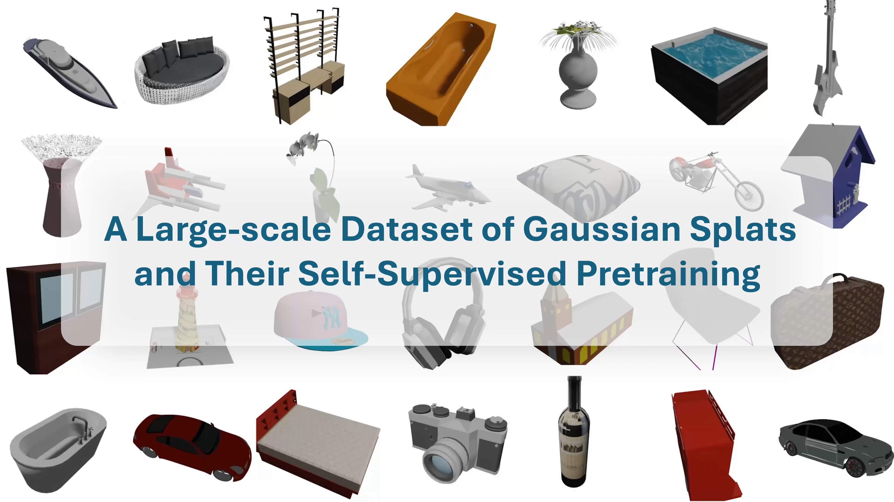
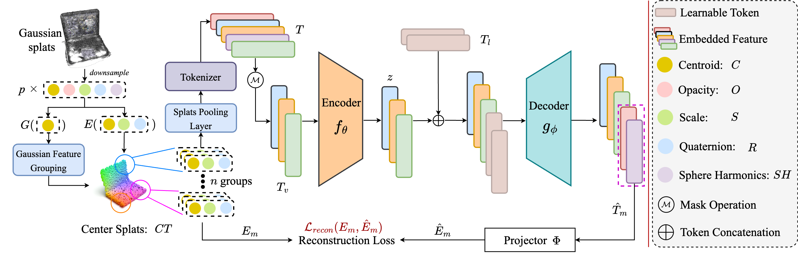

# ShapeSplat-Gaussian-MAE

    

The offical implementation of our work: <strong>ShapeSplat: A Large-scale Dataset of Gaussian Splats and Their Self-Supervised Pretraining</strong>.

#### $^\star$[Qi Ma](https://qimaqi.github.io/)1,2, $^\star$[Yue Li](https://unique1i.github.io/)3, $^\dagger$[Bin Ren](https://amazingren.github.io/)2,4,5, [Nicu Sebe](https://scholar.google.com/citations?user=stFCYOAAAAAJ&hl=en)5, [Ender Konukoglu](https://people.ee.ethz.ch/~kender/) 1, [Theo Gevers](https://scholar.google.com/citations?user=yqsvxQgAAAAJ&hl=en&oi=ao)3, [Luc Van Gool ](https://scholar.google.com/citations?user=TwMib_QAAAAJ&hl=en)1,2, and [Danda Pani Paudel](https://scholar.google.com/citations?user=W43pvPkAAAAJ&hl=en)1,2 
$^\star$: Equal Contribution, $^\dagger$: Corresponding Author  

1 ETH Zürich, Switzerland  
2 INSAIT Sofia University, Bulgaria  
3 University of Amsterdam, Netherlands  
4 University of Pisa, Italy  
5 University of Trento, Italy  

<strong style="vertical-align: middle;"></strong>
    <!--
    -->

## News
- [x] `20.08.2024`: The [Project Page](https://unique1i.github.io/ShapeSplat/) is released!
- [x] `21.08.2024`: The Paper is released on [Arxiv](https://arxiv.org/pdf/2408.10906).
- [ ] Dataset release: We are actively discussing this detail with the ShapeNet team and provide an update as soon as possible. Stay tuned! 
- [ ] Code release

## Method

    

  

  Abstract
  

3D Gaussian Splatting (3DGS) has become the de facto method of 3D representation in many vision tasks. This calls for the 3D understanding directly in this representation space. To facilitate the research in this direction, we first build a large-scale dataset of 3DGS using the commonly used ShapeNet and ModelNet datasets. Our dataset ShapeSplat consists of 65K objects from 87 unique categories, whose labels are in accordance with the respective datasets. The creation of this dataset utilized the compute equivalent of 2 GPU years on a TITAN XP GPU.
We utilize our dataset for unsupervised pretraining and supervised finetuning for classification and segmentation tasks. To this end, we introduce Gaussian-MAE, which highlights the unique benefits of representation learning from Gaussian parameters. Through exhaustive experiments, we provide several valuable insights. In particular, we show that (1) the distribution of the optimized GS centroids significantly differs from the uniformly sampled point cloud (used for initialization) counterpart; (2) this change in distribution results in degradation in classification but improvement in segmentation tasks when using only the centroids; (3) to leverage additional Gaussian parameters, we propose Gaussian feature grouping in a normalized feature space, along with splats pooling layer, offering a tailored solution to effectively group and embed similar Gaussians, which leads to notable improvement in finetuning tasks.

  

  中文摘要
  

3D高斯溅射（3DGS）已成为许多视觉任务中的3D表征。目前的研究没有涉及到对高斯参数本身的自监督式理解。为推动该方向的研究，我们首先使用常用的ShapeNet和ModelNet数据集构建了一个大规模的3DGS数据集。我们的数据集ShapeSplat包含来自87个独特类别的65K个对象，其标签与各自的数据集保持一致。创建该数据集使用了相当于2个GPU年（在TITAN XP GPU上）的计算量。
我们利用这个数据集进行无监督预训练和有监督微调，以用于分类和分割任务。为此，我们引入了Gaussian-MAE，突出了从高斯参数进行表示学习的独特优势。通过详尽的实验，我们提供了几个有价值的见解。特别是，我们展示了：（1）优化后的GS中心的分布与用于初始化的均匀采样的点云相比有显著差异；（2）这种分布变化在仅使用中心时导致分类任务的性能下降，但分割任务的性能提升；（3）为有效利用高斯参数，我们提出了在归一化特征空间中进行高斯特征分组，并结合高斯池化层，提供了针对相似高斯的有效分组和提取特征的方案，从而在微调任务中显著提升了性能。

## Datasets

## Installation

## Citation

If you find our work helpful, please consider citing the following paper and/or ⭐ the repo.

<pre>
<code>
@misc{ma2024shapesplat,
      title={ShapeSplat: A Large-scale Dataset of Gaussian Splats and Their Self-Supervised Pretraining}, 
      author={Qi Ma and Yue Li and Bin Ren and Nicu Sebe and Ender Konukoglu and Theo Gevers and Luc Van Gool and Danda Pani Paudel},
      year={2024},
      eprint={2408.10906},
      archivePrefix={arXiv},
      primaryClass={cs.CV},
      url={https://arxiv.org/abs/2408.10906}, 
}
</code>
</pre>

## Acknowledgements

