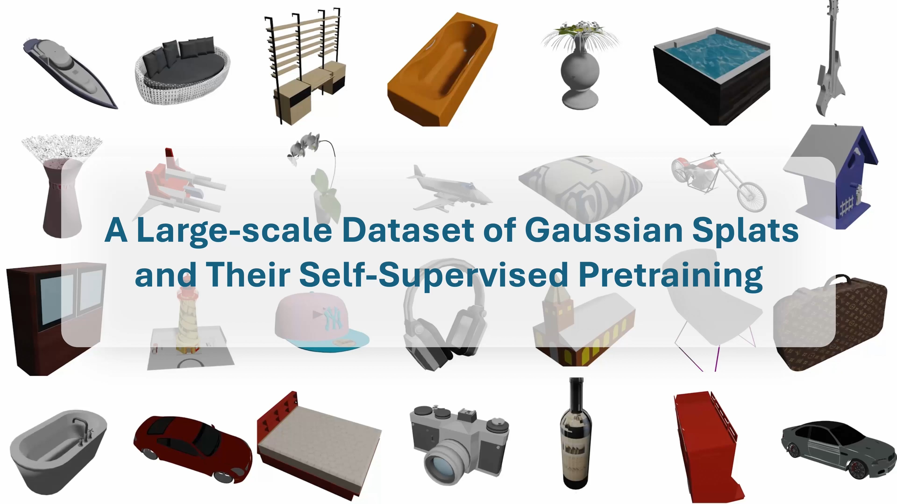
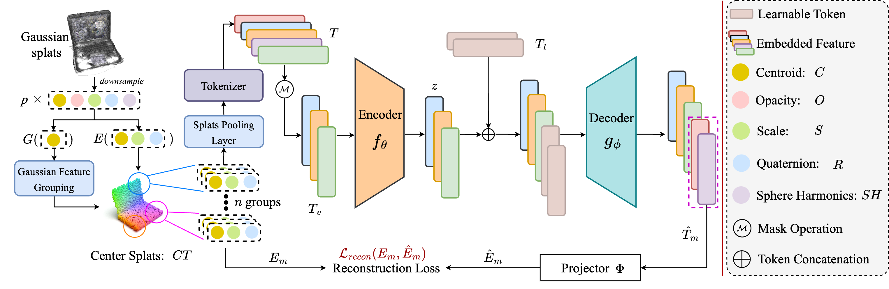

# ShapeSplat

<p align="left">
    
</p>

The official implementation of our work: <strong>ShapeSplat: A Large-scale Dataset of Gaussian Splats and Their Self-Supervised Pretraining</strong>.

#### $^\star$[Qi Ma](https://qimaqi.github.io/)<sup>1,2</sup>, $^\star$[Yue Li](https://unique1i.github.io/)<sup>3</sup>, $^\dagger$[Bin Ren](https://amazingren.github.io/)<sup>2,4,5</sup>, [Nicu Sebe](https://scholar.google.com/citations?user=stFCYOAAAAAJ&hl=en)<sup>5</sup>, [Ender Konukoglu](https://people.ee.ethz.ch/~kender/) <sup>1</sup>, [Theo Gevers](https://scholar.google.com/citations?user=yqsvxQgAAAAJ&hl=en&oi=ao)<sup>3</sup>, [Luc Van Gool ](https://scholar.google.com/citations?user=TwMib_QAAAAJ&hl=en)<sup>1,2</sup>, and [Danda Pani Paudel](https://scholar.google.com/citations?user=W43pvPkAAAAJ&hl=en)<sup>1,2</sup> 
$^\star$: Equal Contribution, $^\dagger$: Corresponding Author <br>

<sup>1</sup> ETH Zürich, Switzerland <br>
<sup>2</sup> INSAIT Sofia University, Bulgaria <br>
<sup>3</sup> University of Amsterdam, Netherlands <br>
<sup>4</sup> University of Pisa, Italy <br>
<sup>5</sup> University of Trento, Italy <br>

[](https://arxiv.org/abs/2408.10906)
[](https://unique1i.github.io/ShapeSplat_webpage/)
[](https://huggingface.co/datasets/ShapeNet/ShapeSplatsV1)
[](https://huggingface.co/datasets/ShapeSplats/ModelNet_Splats)
[](https://huggingface.co/datasets/ShapeSplats/Objaverse_Splats)


## News
- [x] `05.09.2025`: We extend our ShapeSplat dataset with Objaverse split, now the total number of objects is 206K!
- [x] `24.07.2025`: Our SceneSplat project, which extends to 3DGS scene pretraining is accepted as ICCV 2025 oral! 🎉 Check out the [project page](https://unique1i.github.io/SceneSplat_webpage/).
- [x] `23.03.2025`: The 2D renderings together with camera parameters are released on [Huggingface](https://huggingface.co/datasets/ShapeSplats/sharing).
- [x] `24.12.2024`: ShapeSplat is accepted as 3DV oral! 🎄 Meet you in Singapore!
- [x] `16.12.2024`: Code release.
- [x] `08.09.2024`: The ModelNet-Splats is released on [Huggingface](https://huggingface.co/datasets/ShapeSplats/ModelNet_Splats). Please follow the ModelNet [term of use](https://modelnet.cs.princeton.edu/#).
- [x] `05.09.2024`: Dataset rendering code release in [render_scripts](./render_scripts)
- [x] `05.09.2024`: Our ShapeSplat [dataset](https://huggingface.co/datasets/ShapeNet/ShapeSplatsV1) part is released under the official ShapeNet repository! We thank the support from the ShapeNet team!
- [x] `21.08.2024`: The Paper is released on [Arxiv](https://arxiv.org/pdf/2408.10906).
- [x] `20.08.2024`: The [Project Page](https://unique1i.github.io/ShapeSplat/) is released!


## Method

<p align="left">
    
</p>
<details>
  <summary>
  <font size="+1">Abstract</font>
  </summary>
3D Gaussian Splatting (3DGS) has become the de facto method of 3D representation in many vision tasks. This calls for the 3D understanding directly in this representation space. To facilitate the research in this direction, we first build a large-scale dataset of 3DGS using the commonly used ShapeNet and ModelNet datasets. Our dataset ShapeSplat consists of 65K objects from 87 unique categories, whose labels are in accordance with the respective datasets. The creation of this dataset utilized the compute equivalent of 2 GPU years on a TITAN XP GPU.
We utilize our dataset for unsupervised pretraining and supervised finetuning for classification and segmentation tasks. To this end, we introduce Gaussian-MAE, which highlights the unique benefits of representation learning from Gaussian parameters. Through exhaustive experiments, we provide several valuable insights. In particular, we show that (1) the distribution of the optimized GS centroids significantly differs from the uniformly sampled point cloud (used for initialization) counterpart; (2) this change in distribution results in degradation in classification but improvement in segmentation tasks when using only the centroids; (3) to leverage additional Gaussian parameters, we propose Gaussian feature grouping in a normalized feature space, along with splats pooling layer, offering a tailored solution to effectively group and embed similar Gaussians, which leads to notable improvement in finetuning tasks.
</details>

<details>
  <summary>
  <font size="+1">中文摘要</font>
  </summary>
3D高斯溅射（3DGS）已成为许多视觉任务中的3D表征。目前的研究没有涉及到对高斯参数本身的自监督式理解。为推动该方向的研究，我们首先使用常用的ShapeNet和ModelNet数据集构建了一个大规模的3DGS数据集。我们的数据集ShapeSplat包含来自87个独特类别的65K个对象，其标签与各自的数据集保持一致。创建该数据集使用了相当于2个GPU年（在TITAN XP GPU上）的计算量。
我们利用这个数据集进行无监督预训练和有监督微调，以用于分类和分割任务。为此，我们引入了Gaussian-MAE，突出了从高斯参数进行表示学习的独特优势。通过详尽的实验，我们提供了几个有价值的见解。特别是，我们展示了：（1）优化后的GS中心的分布与用于初始化的均匀采样的点云相比有显著差异；（2）这种分布变化在仅使用中心时导致分类任务的性能下降，但分割任务的性能提升；（3）为有效利用高斯参数，我们提出了在归一化特征空间中进行高斯特征分组，并结合高斯池化层，提供了针对相似高斯的有效分组和提取特征的方案，从而在微调任务中显著提升了性能。
</details>


## ShapeSplat
Our ShapeSplat dataset contains three splits: ShapeNet part, ModelNet part, and Objaverse part, in total of **206K** objects. The following table summarizes the statistics of each split.

| Data Split | ShapeNet-Core | ModelNet | Objaverse |
|---|---|---|---|
| Category | 55 | 40 | - |
| Objects | 52,121 | 12,309 | 141,703 |
| GPU-days (L4) | 548.41 | 51.03 | 787.23 |
| Avg. Gaussians | 24,267 | 22,456 | 50,000 |
| PSNR | 44.187 | 45.104 | 33.71 |

The ModelNet part, and Objaverse part, are hosted at [ModelNet_Splats](https://huggingface.co/datasets/ShapeSplats/ModelNet_Splats) and [Objaverse_Splats](https://huggingface.co/datasets/ShapeSplats/Objaverse_Splats).

Please download the ShapeNet part from the official ShapeNet [repository](https://huggingface.co/datasets/ShapeNet/ShapeSplatsV1). Due to file size limitation, some of the subsets may be splitted into multiple zip files (e.g. 03001627_0.zip and 03001627_1.zip). Please unzip data and merge them by using the [unzip.sh](scripts/unzip.sh): 

<details>
  <summary>
  <font>Read the 3DGS file</font>
  </summary>
  PLY format is commonly used for Gaussian splats and can be viewed using online viewer like supersplat. Also, you can load the ply file using <u>numpy</u> and <u>plyfile</u>.

  ```python
from plyfile import PlyData
import numpy as np
gs_vertex = PlyData.read('ply_path')['vertex']
### load centroids[x,y,z] - Gaussian centroid
x = gs_vertex['x'].astype(np.float32)
y = gs_vertex['y'].astype(np.float32)
z = gs_vertex['z'].astype(np.float32)
centroids = np.stack((x, y, z), axis=-1) # [n, 3]

### load o - opacity
opacity = gs_vertex['opacity'].astype(np.float32).reshape(-1, 1)


### load scales[sx, sy, sz] - Scale
scale_names = [
    p.name
    for p in gs_vertex.properties
    if p.name.startswith("scale_")
]
scale_names = sorted(scale_names, key=lambda x: int(x.split("_")[-1]))
scales = np.zeros((centroids.shape[0], len(scale_names)))
for idx, attr_name in enumerate(scale_names):
    scales[:, idx] = gs_vertex[attr_name].astype(np.float32)

### load rotation rots[q_0, q_1, q_2, q_3] - Rotation
rot_names = [
    p.name for p in gs_vertex.properties if p.name.startswith("rot")
]
rot_names = sorted(rot_names, key=lambda x: int(x.split("_")[-1]))
rots = np.zeros((centroids.shape[0], len(rot_names)))
for idx, attr_name in enumerate(rot_names):
    rots[:, idx] = gs_vertex[attr_name].astype(np.float32)

rots = rots / (np.linalg.norm(rots, axis=1, keepdims=True) + 1e-9)

### load base sh_base[dc_0, dc_1, dc_2] - Spherical harmonic
sh_base = np.zeros((centroids.shape[0], 3, 1))
sh_base[:, 0, 0] = gs_vertex['f_dc_0'].astype(np.float32)
sh_base[:, 1, 0] = gs_vertex['f_dc_1'].astype(np.float32)
sh_base[:, 2, 0] = gs_vertex['f_dc_2'].astype(np.float32)
sh_base = sh_base.reshape(-1, 3)
```
</details>


## Installation

Please set up provided conda environment with Python 3.9, PyTorch 2.0.1, and CUDA 11.8. 

```bash
git clone https://github.com/qimaqi/ShapeSplat-Gaussian_MAE.git
cd ShapeSplat-Gaussian_MAE
conda config --set channel_priority flexible
conda env create -f env.yaml
```

## Data Preparation

Please refer to the instructions in the [DATA.md](./DATA.md) on data preparation. The instructions cover:  
- Prepare the pretraining dataset.  
- Set up finetuning datasets for classification and segmentation tasks.  
- Update the data config and some environement parameters

### 2D Rendering Results

We released the 2D rendering results of ShapeSplat dataset, which can be downloaded from [Huggingface](https://huggingface.co/datasets/ShapeSplats/sharing). The 2D renders are generated using the [render_scripts](./render_scripts). The image/depth/normal renders are in the [ShapeSplat_2d_renders](https://huggingface.co/datasets/ShapeSplats/sharing/tree/main/ShapeSplat_2d_renders) folder, and the camera parameters are saved in per-object `transforms.json` in the [ShapeSplat_render_cams](https://huggingface.co/datasets/ShapeSplats/sharing/tree/main/ShapeSplat_render_cams) folder.

Note, there is coordinate inconsistency at the beginning, the poses of the 2D renderings saved in frame['transform_matrix'] is not aligned to the world coordinate of the 3DGS object and the OBJ mesh. Please refer to the [README](https://huggingface.co/datasets/ShapeSplats/sharing/blob/main/README.md) for alignment.


## Pretraining

In this section, we outline the steps to pretrain the Gaussian-MAE model. For each setup, we use a config file located in the `cfgs/pretrain` directory.

Below are some important parameters you can modify to create new experiment setups:

- `dataset.{split}.others.norm_attribute` 
This parameter connects with Section 4.2 of the paper, which discusses the attribute used for normalization.

- `model.group_size` 
Specifies the number of gaussians considered for one group/token.
  
- `model.num_group`
Specifies the number of groups/tokens.

- `model.attribute` 
The embedding feature discussed in Section 4.1 of the paper.

- `model.group_attribute` 
The grouping feature discussed in Section 4.1 of the paper.

- `npoints` 
The number of points after sampling from the input Gaussians is ablated in Table E.1 in the supplementary material. Note that you need to modify th `group_size` and `num_group` accordingly.

- `soft_knn` 
To enable the **splats pooling layer** discussed in Section 4.3 of the paper, in the experiments you should set group_attribute = ['xyz'] when enabling the soft KNN.


In following example we show the example code to pretrain with E(All), G(xyz) defined in `pretrain_job_enc_full_group_xyz_1k.sh` in  `sh_jobs/pretrain`. The command is shown below. Use the `--config` flag and set the experiment name in `--exp_name` accordingly. If the job is stopped and needs to be resumed, use the `--resume` flag.
 

```bash
python main.py \
    --config cfgs/pretrain/pretrain_enc_full_group_xyz_1k.yaml \
    --exp_name gaussian_mae_enc_full_group_xyz_1k \
    --soft_knn \ 
    # --resume 
```


## ModelNet Finetuning
After pretraining, you can submit the finetuning task with `cls10_job_enc_full_group_xyz_4k.sh` in  `sh_jobs/finetune`. Similar to pretraining, you have to define one config for each experiment. Notice that the finetuning parameters need to be aligned with the pretraining config.

```bash
python main.py \
    --config cfgs/fintune/finetune_modelnet10_enc_full_group_xyz_4k.yaml \
    --finetune_model \
    --exp_name release_finetune_modelnet10_full_4k_pretrain_1k_softknn \
    --seed 0 \
    --ckpts ${PRETRAIN_CKPT} \
    --soft_knn \
    # --use_wandb \
```

## ShapeSplat-Part Segmentation
For ShapeSplat-Part segmentation, we utilize the Gaussian splats generated for ShapeNet-Part. Since ShapeNet-Part is a subset of ShapeNetCore, please refer to [DATA.md](./DATA.md) for instructions on downloading the segmentation annotation files.

For simplicity, we follow the approach in Point-MAE and create a separate folder for part segmentation finetuning. Please refer to [segmentation_gs](./segmentation_gs/) for detailed usage instructions.


## Reproducing Results
We reproduce the modelnet10/modelnet40 finetuning classification results with the released codebase in the following table, which is consistent with the results reported in the paper. The best results are obtained with pretraining using objects of 1k Gaussians and finetuning on 4k Gaussians. The corresponding model checkpoints are uploaded at [gaussian_mae_ckpts](https://huggingface.co/datasets/ShapeSplats/sharing/tree/main/gaussian_mae_ckpts). Note the results will vary during different runs.

| GS number | pretrain 1k |  | pretrain 4k |  |
|--------|-------------|-------------|-------------|-------------|
| **soft_knn** | True | False | True | False |
| **finetune 4k** | 95.70484/<br>92.41994 | 95.37445/<br>93.43332 | 95.48458/<br>92.41994 | 95.26431/<br>93.06851 |


**Pretraining** results are stored in the `experiments/<config_name>/` folder. Within this folder, you will find the `<exp_name>` and `TFBoard` subdirectories.

- **TensorBoard Logging**: Pretraining loss is logged in TensorBoard.
- **Using Weights & Biases**: To log metrics via Weights & Biases, pass the `--use_wandb` argument during training.
- **Gaussian Reconstruction**: The reconstructed Gaussians from the last epoch are saved in the `save_ply` folder. These can be visualized using standard Gaussian visualization tools like the [Interactive Viewer](https://github.com/graphdeco-inria/gaussian-splatting?tab=readme-ov-file#interactive-viewers) or the [Online Viewer](https://playcanvas.com/supersplat/editor/).

**ModelSplat finetuning** results are similarly stored in the `experiments/<config_name>/` folder.

- **Accuracy Logging**: The best accuracy is logged with wandb, also you can find it in the `.log` file by searching for `ckpt-best.pth`.

We provide the checkpoints of pretrained model using all the 3DGS attributes, and the corresponding finetuned model on ModelNet10 and ModelNet40 in the [ckpts](https://huggingface.co/datasets/ShapeSplats/sharing/tree/main/ckpts).


## Citation

If you find our method/dataset helpful, please consider citing our paper and/or ⭐ our repo.
<div style="max-width: 1200px; overflow-x: auto;">
<pre>
<code>
  @inproceedings{ma2025large,
    title={A Large-Scale Dataset of Gaussian Splats and Their Self-Supervised Pretraining},
    author={Ma, Qi and Li, Yue and Ren, Bin and Sebe, Nicu and Konukoglu, Ender and Gevers, Theo and Van Gool, Luc and Paudel, Danda Pani},
    booktitle={2025 International Conference on 3D Vision (3DV)},
    pages={145--155},
    year={2025},
    organization={IEEE}
  }
</code>
</pre>
</div>

## Acknowledgements
We sincerely thank the ShapeNet and ModelNet teams for their efforts in creating and open-sourcing the datasets. We express our gratitude to the team of Point-MAE for providing the public codebase, which served as the foundation for our further development.
